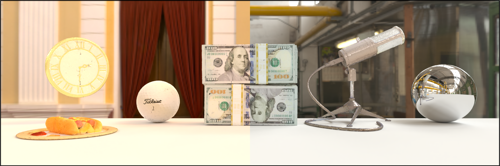

# <p align="center"> <font color=#008000>MaterialFusion</font>: Enhancing Inverse Rendering with Material Diffusion Priors </p>

#####  <p align="center"> [Yehonathan Litman](https://yehonathanlitman.github.io/), [Or Patashnik](https://orpatashnik.github.io/), [Kangle Deng](https://dunbar12138.github.io/), [Aviral Agrawal](https://aviral-agrawal.github.io/), [Rushikesh Zawar](https://github.com/RBZ-99),<br> [Fernando De la Torre](https://www.cs.cmu.edu/~ftorre/), [Shubham Tulsiani](https://shubhtuls.github.io/)</p>
 
#### <p align="center">[Paper](https://arxiv.org/abs/TODO) | [Project Page](https://yehonathanlitman.github.io/material_fusion/) 
<!-- | [BlenderVault Dataset](assets/todo.txt)</p> -->



# Installation

#### Tested on Pop OS 24.04 + Pytorch 2.1.2 using a RTX6000

```
conda create -n materialfusion python=3.8
conda activate materialfusion
pip install torch==2.1.2+cu118 torchvision==0.16.2+cu118 --extra-index-url https://download.pytorch.org/whl/cu118
conda install -c "nvidia/label/cuda-11.8.0" cuda-toolkit
pip install ninja git+https://github.com/NVlabs/tiny-cuda-nn/#subdirectory=bindings/torch
pip install git+https://github.com/NVlabs/nvdiffrast/
pip install imageio PyOpenGL glfw xatlas gdown wget kornia diffusers["torch"] transformers
```

# Datasets

## BlenderVault

BlenderVault is a curated dataset containing 11,716 synthetic Blender objects designed by artists. The objects are diverse in nature and contain high quality property assets that are extracted and used to generate training data for our material diffusion prior. We are currently preparing this dataset and will upload all the files soon!

https://github.com/user-attachments/assets/5a25aa21-cb0b-47e4-80fd-c2e531a73885

## Downloading

We evaluate MaterialFusion and our material diffusion prior on a mixture of synthetic and real image data. To download the NeRF, NeRFactor, Stanford-ORB, MaterialFusion, and StableMaterial datasets, run the `data/download_datasets.py` script. The configs that correspond to each object and dataset are included at `configs/materialfusion` and are needed by MaterialFusion.

If you would like to download the datasets individually, follow the links below and put them in the `data` directory:

* [NeRF-Synthetic](https://drive.google.com/file/d/1qGP4rbKRJk1LLtffWmTpaZspDHjl1y_o/view?usp=sharing) - Extract this into `data/nerf_synthetic`.

* [NeRFactor](https://drive.google.com/drive/folders/1wTX6RuifMCe2xvyk00dlBSsKxO_vuwlp) - The four datasets should be placed in the folders `data\nerfactor\hotdog_2163`, `data\nerfactor\drums_3072`, `data\nerfactor\ficus_2188`, and `data\nerfactor\lego_3072`.

* [MaterialFusion Dataset](https://drive.google.com/file/d/1xcmn6AO1KL22qcWjWc8cm31D8xR4LBrQ/view?usp=sharing) - This is a dataset containing multi-view images of 9 unseen objects from BlenderVault. Extract them into `data/materialfusion_dataset`.

* [StableMaterial Dataset](https://drive.google.com/file/d/1qGP4rbKRJk1LLtffWmTpaZspDHjl1y_o/view?usp=sharing) - This dataset contains 4 images per object for 8 unseen objects from BlenderVault for evaluating the material diffusion prior. Extract them into `data/stablematerial_dataset`.

* [Stanford-ORB](https://stanfordorb.github.io/) - Download and extract [`blender_LDR.tar.gz`](https://downloads.cs.stanford.edu/viscam/StanfordORB/blender_LDR.tar.gz) into `data/blender_LDR`. We will upload the config files for Stanford-ORB objects soon!

### Preparing your own data

The training data assumes poses are available and the background is masked out. For synthetic data, you may use the BlenderVault rendering script (which we will soon upload) or use [NeRFactor's code](https://drive.google.com/file/d/1mnh81gvxSzCl_2-S2jAnXxsyZSpz0Kga/view?usp=sharing). For real data, you can use [SAM](https://segment-anything.com/) to mask out the background and process your images. You can also use [COLMAP](https://github.com/colmap/colmap) to estimate the poses.

# Training

To begin training MaterialFusion:
```
python run_materialfusion.py --config configs/materialfusion/vault-box.json
```

Note that MaterialFusion uses a lot of memory during inverse rendering and may crash. To alleviate this you can reduce the `batch` parameter in the config file or pass a smaller batch to StableMaterial via the `--sds_batch_limiter` flag:

```
python run_materialfusion.py --config configs/materialfusion/vault-box.json --sds_batch_limiter 2
```

### Importing into Blender

Once you are done training MaterialFusion, the output folder will contain the recovered mesh geometry, material maps, and environment lighting. They can be loaded into Blender using [blender.py](blender/blender.py).

# StableMaterial - Material Diffusion Prior

We also provide inference (and soon training) code for our material diffusion prior.

The model checkpoints can be downloaded with the `data/download_stablematerial_ckpts.py` script. For simplicity, we provide checkpoints for the single-view and multi-view models.

* [StableMaterial](https://drive.google.com/file/d/1RDk3cvci1BPAVDWrk2ZzLLPwIlTLkt_4/view?usp=sharing) - Extract this into `data/stablematerial-model`.

* [StableMaterial-MV](https://drive.google.com/file/d/1qGP4rbKRJk1LLtffWmTpaZspDHjl1y_o/view?usp=sharing) - This checkpoint attends to information across views to predict materials that are consistent across multiple views. This helps with difficult views, as seen in the cup example below. Extract this into `data/stablematerial-mv-model`.

### Preparing your own data

StableMaterial doesn't need pose information and only assumes masked images. StableMaterial-MV requires pose information in addition to masked images.

## Evaluation

For single view prediction (StableMaterial):

```
python run_stablematerial.py --data_path data/stablematerial_dataset/<object_id>/train/<object_id>
```

Results will be saved in `out/stablematerial_pred/single_view/<object_id>`.

For multi-view prediction (StableMaterial-MV)

```
python run_stablematerial.py --data_path data/stablematerial_dataset/<object_id> --num_views 4
```

Results will be saved in `out/stablematerial_pred/multi_view/<object_id>`.


# Acknowledgments

MaterialFusion was built on top of [nvdiffrecmc](https://github.com/NVlabs/nvdiffrecmc), check it out!
